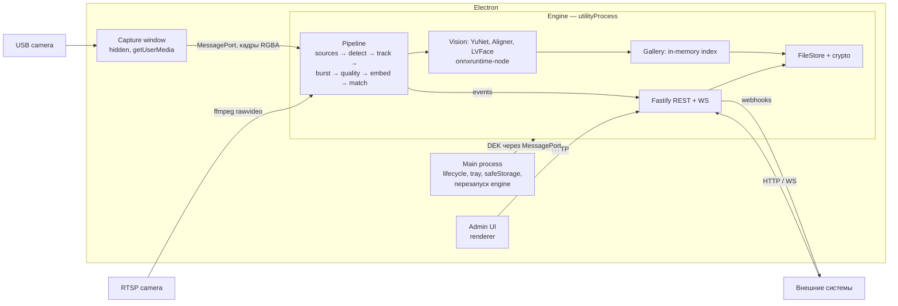

# ТЗ: Локальный сервер распознавания лиц (рабочее название — FaceID Engine)

| Поле | Значение |
|---|---|
| Версия | 0.1 (черновик) |
| Платформа | Node.js (TypeScript), дистрибуция — Electron-приложение |
| Модели | YuNet (детекция) + LVFace (эмбеддинги), ONNX Runtime |
| Хранилище | Файловое, без векторной БД |

---

## 1. Цель

Локальный офлайн-сервер, который:

1. Получает видеопоток с камеры, находит лицо, собирает серию кадров, отбирает лучшие.
2. Строит эмбеддинги через LVFace (ONNX) и сравнивает их с сохранёнными эмбеддингами зарегистрированных людей.
3. Выдаёт событие распознавания: `match` / `unknown` / `uncertain` / `low_quality`.
4. Предоставляет REST API для CRUD зарегистрированных людей: персональные данные + эталонные фото.

Сервер поставляется как Electron-приложение и работает без сети. Все модели входят в дистрибутив.

## 2. Границы

**В scope v1:**
- Источники видео: USB/встроенная веб-камера и RTSP/IP-камера. Видеофайл — для отладки.
- Детекция, выравнивание, оценка качества, трекинг, серия кадров, эмбеддинги, сопоставление 1:N.
- CRUD людей и фото, регистрация по загруженному фото и по кадрам с камеры.
- Файловое хранилище с шифрованием, индекс эмбеддингов в памяти.
- Выдача событий: WebSocket, webhooks, журнал распознаваний.
- Минимальная админка в Electron: статус потоков, настройки, список людей и форма регистрации. Работает через тот же REST API.
- Инструмент калибровки порогов.

**Вне scope v1:**
- Liveness / anti-spoofing. В v1 предусмотрен интерфейс-заглушка (§7.9).
- Векторная БД, кластеризация, поиск по архиву видео.
- Распознавание в толпе: v1 рассчитан на кооперативный сценарий, когда человек подходит к камере.
- Облачная синхронизация между установками.

## 3. Термины

| Термин | Значение |
|---|---|
| Person | Зарегистрированный человек: персональные данные + 1..N эталонных фото |
| Photo | Эталонное фото Person. Хранятся оригинал, выровненный кроп и эмбеддинг |
| Embedding | Вектор признаков лица из LVFace, L2-нормализованный, `Float32Array[D]` (ожидаемо D=512) |
| Gallery | Все эмбеддинги активных Person, загруженные в память как матрица N×D |
| Probe | Эмбеддинг лица с камеры (усреднённый по серии кадров) |
| Track | Одно лицо, прослеживаемое между кадрами одного потока |
| Burst | Серия кадров одного Track, из которой выбираются лучшие |
| Aligned face | Кроп лица 112×112, выровненный по 5 точкам к шаблону ArcFace |

## 4. Архитектура



**Принципы:**
- Вся логика (API, пайплайн, модели, хранилище) живёт в одном **Engine**-процессе (`utilityProcess.fork`). Main-процесс не выполняет вычислений.
- `onnxruntime-node` выполняет инференс асинхронно в собственном пуле потоков, поэтому event loop Engine не блокируется. Тяжёлые JS-вычисления (выравнивание, метрики качества) — на `worker_threads`, если профилирование покажет необходимость.
- Веб-камера захватывается в скрытом окне через `getUserMedia`: это кроссплатформенно и не требует нативных модулей. Кадры передаются в Engine через `MessageChannelMain` как transferable `ArrayBuffer`.
- RTSP и файлы читаются в Engine через дочерний процесс `ffmpeg` в формате `rawvideo bgr24`.
- Все компоненты зрения скрыты за интерфейсами (§7.1). Модель эмбеддингов заменяема через манифест (§6.4).

## 5. Стек

| Компонент | Выбор | Примечание |
|---|---|---|
| Язык | TypeScript (strict), Node.js той версии, что встроена в выбранный Electron | |
| Оболочка | Electron (последняя стабильная), electron-builder | |
| HTTP | Fastify, `@fastify/multipart`, `@fastify/websocket` | |
| Валидация | zod (+ `fastify-type-provider-zod`) | Схемы — единый источник для API и UI |
| Инференс | `onnxruntime-node` | EP: CPU обязательно; CUDA (Linux/Win) / DirectML (Win) — опционально, проверить на целевой версии |
| Изображения | `sharp` | decode, EXIF-rotate, resize, encode |
| RTSP/файлы | `ffmpeg` (бандлится) | Для коммерческой дистрибуции нужна LGPL-сборка (§17) |
| Логи | pino + ротация | Без персональных данных (§12) |
| Тесты | vitest; Python-скрипты-эталоны для parity-тестов | |
| ID | UUID v7 | Сортируемые по времени |

## 6. Модели

### 6.1 Детектор — YuNet (OpenCV Zoo)

- Файл: `face_detection_yunet_2026may.onnx` (динамический вход). Лицензия MIT.
- Вход: `float32 [1, 3, H, W]`, **BGR**, NCHW, **без нормализации**. H и W кратны 32.
- Выход: 12 тензоров — `cls_{s}`, `obj_{s}`, `bbox_{s}`, `kps_{s}` для страйдов s ∈ {8, 16, 32}.
- Ограничение модели: уверенно находит лица размером примерно от 10×10 до 300×300 px. Поэтому **кадр перед детекцией уменьшается** так, чтобы длинная сторона была `detector.inputLongSide` (по умолчанию 640), и дополняется нулями до кратности 32. Координаты масштабируются обратно, кроп берётся из оригинального кадра.

**Декодирование** (сверить с `FaceDetectorYN`, `modules/objdetect/src/face_detect.cpp` в OpenCV). Для каждого страйда `s`, ячейки `(row, col)`, индекса `i = row * (W/s) + col`:

```
cls = clamp(cls_s[i], 0, 1); obj = clamp(obj_s[i], 0, 1)
score = sqrt(cls * obj)
cx = (col + bbox_s[i*4+0]) * s
cy = (row + bbox_s[i*4+1]) * s
w  = exp(bbox_s[i*4+2]) * s
h  = exp(bbox_s[i*4+3]) * s
box = [cx - w/2, cy - h/2, w, h]
landmark[k] = ((kps_s[i*10+2k] + col) * s, (kps_s[i*10+2k+1] + row) * s),  k = 0..4
```

Затем фильтр `score ≥ detector.scoreThreshold` (0.9) и NMS с IoU `detector.nmsThreshold` (0.3).

Порядок точек YuNet: правый глаз, левый глаз, нос, правый угол рта, левый угол рта (с точки зрения человека). Этот порядок совпадает с шаблоном ArcFace. **Юнит-тест обязателен:** на фронтальном лице `landmark[0].x < landmark[1].x`.

### 6.2 Выравнивание

- Similarity transform (Umeyama, без отражения) от 5 точек к шаблону ArcFace 112×112:

```
[38.2946, 51.6963], [73.5318, 51.5014], [56.0252, 71.7366],
[41.5493, 92.3655], [70.7299, 92.2041]
```

- Warp: обратное отображение, билинейная интерполяция, граница — константа 0. Реализуется на чистом TS (112×112 = 12 544 пикселя), чтобы поведение совпадало с эталоном `insightface.utils.face_align.norm_crop` (`skimage SimilarityTransform` + `cv2.warpAffine`).
- Выход: `AlignedFace` — RGB `Uint8Array` 112×112×3 + матрица трансформации.

### 6.3 Эмбеддинги — LVFace

Варианты (обучены на Glint360K), точность по README (TAR на IJB-C):

| Вариант | IJB-C @1e-5 | IJB-C @1e-4 | Назначение |
|---|---|---|---|
| LVFace-T | 95.63 | 96.67 | Слабые CPU |
| LVFace-S | 96.52 | 97.31 | **По умолчанию на CPU** |
| LVFace-B | 97.00 | 97.70 | По умолчанию при наличии GPU |
| LVFace-L | 97.02 | 97.66 | Не использовать: нет выигрыша над B |

- Вход/выход и предобработку **зафиксировать на этапе M1**: форму входа снять в Netron (ожидаемо `[N, 3, 112, 112]`), порядок каналов, нормализацию (для ArcFace-семейства обычно `(x − 127.5) / 127.5`) и поддержку динамического batch — точно по `inference_onnx.py` из репозитория LVFace. Зафиксированные значения записываются в манифест (§6.4).
- Выход L2-нормализуется в Engine всегда, даже если модель уже нормализует.
- **Лицензия весов LVFace — только некоммерческое исследовательское использование** (§17, риск R1).

### 6.4 Манифест моделей

Файл `models/manifest.json`. Engine при старте проверяет `sha256` и отказывается стартовать при несовпадении.

```json
{
  "detector": {
    "id": "yunet-2026may",
    "file": "face_detection_yunet_2026may.onnx",
    "sha256": "<...>",
    "channelOrder": "BGR",
    "normalize": null
  },
  "embedder": {
    "id": "lvface-s-glint360k",
    "file": "LVFace-S_Glint360K.onnx",
    "sha256": "<...>",
    "inputSize": [112, 112],
    "channelOrder": "RGB",
    "mean": [127.5, 127.5, 127.5],
    "std": [127.5, 127.5, 127.5],
    "embeddingDim": 512,
    "dynamicBatch": true,
    "preprocessVersion": 1
  }
}
```

`channelOrder`, `mean`, `std`, `embeddingDim`, `dynamicBatch` в примере — ожидаемые значения; подтверждаются parity-тестом (§15.1).

`embedder.id` + `preprocessVersion` образуют **modelKey**. Все эмбеддинги в хранилище привязаны к modelKey. Смена модели или предобработки означает переиндексацию (§8.5).

## 7. Конвейер обработки видеопотока

### 7.1 Интерфейсы модулей

```ts
interface Frame {
  data: Uint8Array;          // BGR24, row-major
  width: number;
  height: number;
  ts: number;                // ms, monotonic
  sourceId: string;
}

type Landmarks5 = [[number, number], [number, number], [number, number], [number, number], [number, number]];

interface Detection { box: [number, number, number, number]; landmarks: Landmarks5; score: number; }

interface AlignedFace { rgb: Uint8Array; size: 112; transform: number[]; }

interface FrameSource {
  readonly id: string;
  start(): Promise<void>;
  stop(): Promise<void>;
  onFrame(cb: (f: Frame) => void): void;
  onStatus(cb: (s: SourceStatus) => void): void;
}

interface Detector { detect(frame: Frame): Promise<Detection[]>; }
interface Aligner { align(frame: Frame, lm: Landmarks5): AlignedFace; }

interface Embedder {
  readonly modelKey: string;
  readonly dim: number;
  embed(faces: AlignedFace[]): Promise<Float32Array[]>;   // L2-нормализованные
}

interface QualityAssessor { assess(frame: Frame, det: Detection, face: AlignedFace): QualityReport; }

interface Gallery {
  match(probe: Float32Array, topK: number): MatchCandidate[];   // по Person, не по фото
  upsertPhoto(personId: string, photoId: string, emb: Float32Array): void;
  removePhoto(personId: string, photoId: string): void;
  removePerson(personId: string): void;
  setPersonActive(personId: string, active: boolean): void;
  stats(): { persons: number; embeddings: number };
}

interface LivenessChecker {   // v1: NoopLivenessChecker → { live: true, score: 1 }
  check(faces: AlignedFace[], frames: Frame[]): Promise<{ live: boolean; score: number }>;
}
```

### 7.2 Источники кадров

| Тип | Реализация |
|---|---|
| `webcam` | Скрытое окно захвата: `getUserMedia({ video: { deviceId, width, height, frameRate } })` → `MediaStreamTrackProcessor` / `OffscreenCanvas` → RGBA → transferable `ArrayBuffer` в Engine через `MessageChannelMain`. Engine конвертирует в BGR24. Список устройств — `enumerateDevices()` |
| `rtsp` | Дочерний процесс `ffmpeg -rtsp_transport tcp -i <url> -vf fps=<detectFps>,scale=... -f rawvideo -pix_fmt bgr24 -`, кадры читаются из stdout блоками `W*H*3` |
| `file` | То же через ffmpeg, для отладки и тестов |

- **Backpressure:** обрабатывается только последний пришедший кадр, очередь не растёт. Если Engine занят, промежуточные кадры отбрасываются. Счётчик отброшенных кадров отдаётся в `/health`.
- Частота обработки: `pipeline.detectFps` (по умолчанию 10).
- RTSP: авто-переподключение с экспоненциальной задержкой (1 → 30 с). Статус источника (`starting | running | reconnecting | error | stopped`) публикуется событием.
- ROI (опционально): прямоугольник в кадре, вне которого лица игнорируются.

### 7.3 Трекинг

- Простой IoU-трекер: детекция присоединяется к треку при IoU ≥ 0.3 с последним боксом, иначе создаётся новый трек.
- Трек закрывается, если лицо не видно дольше `tracker.ttlMs` (1000 мс).
- Одновременно распознаётся не больше `pipeline.maxConcurrentTracks` треков (по умолчанию 3, приоритет — самые крупные лица).

### 7.4 Машина состояний трека

```
NEW → COLLECTING → IDENTIFYING → RESOLVED ─(трек жив)→ COOLDOWN
                        │
                        └─ UNCERTAIN / LOW_QUALITY → COLLECTING (повтор, до maxRetries)
```

- **COLLECTING** — сбор серии (§7.5).
- **IDENTIFYING** — эмбеддинги + сопоставление (§7.6–7.7).
- **RESOLVED** — событие опубликовано. Пока трек жив, повторное распознавание не выполняется.
- **COOLDOWN** — если тот же человек (тот же `personId`) повторно появляется в течение `pipeline.cooldownMs` (по умолчанию 10 000), повторное событие `match` не публикуется. Для `unknown` cooldown тоже действует, привязка по треку.

### 7.5 Серия кадров (burst) и качество

Для каждой детекции трека в состоянии COLLECTING:

1. Выравнивание → `AlignedFace` (дёшево, делается для всех кандидатов).
2. Оценка качества → `QualityReport`.
3. Кандидат, прошедший порог качества, попадает в буфер.

Сбор завершается, когда набрано `burst.maxFrames` (10) кадров **или** прошло `burst.windowMs` (1000 мс). Из буфера берутся `burst.topK` (5) лучших по `qualityScore`. Если прошедших порог меньше `burst.minGood` (3), публикуется событие `low_quality` с причинами, затем повтор.

**Метрики качества** (все пороги в конфиге):

| Метрика | Как считать | Порог по умолчанию (поток) |
|---|---|---|
| `detScore` | score детектора | ≥ 0.9 |
| `faceSize` | короткая сторона бокса в пикселях оригинального кадра | ≥ 80 |
| `interocular` | расстояние между глазами, px | ≥ 30 |
| `yaw` (прокси) | \|nose.x − eyesMid.x\| / interocular | ≤ 0.25 |
| `roll` | угол линии глаз | ≤ 25° |
| `sharpness` | дисперсия лапласиана по серому aligned-кропу | ≥ калибруемое значение |
| `brightness` | средняя яркость (luma) aligned-кропа | 40–220 |
| `inFrame` | бокс целиком внутри кадра (без обрезки краем) | true |

`qualityScore` — взвешенная сумма нормированных метрик (веса в конфиге). Используется только для ранжирования; отсечение — по порогам.

### 7.6 Эмбеддинги серии

- `topK` выровненных кропов отправляются в Embedder одним батчем (если `dynamicBatch`), иначе последовательно.
- **Probe** = нормализованное среднее L2-нормализованных эмбеддингов серии.
- Дополнительно сохраняются эмбеддинги отдельных кадров для проверки согласованности (§7.7).

### 7.7 Сопоставление и решение

- Скоры = `G · probe` (косинус, так как всё нормализовано). Полный перебор по матрице в памяти.
- Скор Person = максимум по его эмбеддингам. Берутся top-1 (`s1`) и top-2 (`s2`, другой Person).
- Неактивные Person (`status = disabled`) в сопоставлении не участвуют.

| Условие | Результат |
|---|---|
| `s1 ≥ match.acceptThreshold` **и** `s1 − s2 ≥ match.margin` **и** согласованность ≥ `match.minFrameAgreement` | `match` |
| `s1 < match.rejectThreshold` | `unknown` |
| иначе | `uncertain` → повтор серии (до `pipeline.maxRetries` = 2), затем `unknown` |

Согласованность — доля кадров серии, в которых top-1 по отдельному эмбеддингу совпадает с top-1 по probe (по умолчанию ≥ 0.6).

> Стартовые значения порогов в §11 — **заглушки**. Рабочие значения определяются калибровкой на целевой камере (§15.3).

### 7.8 Событие распознавания

```json
{
  "type": "recognition.result",
  "eventId": "uuid-v7",
  "ts": "2026-09-23T10:15:02.113Z",
  "sourceId": "cam-entrance",
  "trackId": "t-000184",
  "status": "match",
  "person": { "id": "…", "externalId": "E-1042", "firstName": "…", "lastName": "…" },
  "score": 0.63,
  "secondScore": 0.21,
  "frameAgreement": 1.0,
  "framesUsed": 5,
  "attempt": 1,
  "latencyMs": 820,
  "liveness": null,
  "snapshotId": "…"
}
```

- `person` присутствует только при `match`.
- `latencyMs` — от первой детекции трека до публикации события.
- `snapshotId` — только если включено хранение снимков (`events.storeSnapshots`).
- Каналы доставки: WebSocket, webhooks, журнал (§10.5).

### 7.9 Liveness (заглушка v1)

В пайплайне после серии и до сопоставления вызывается `LivenessChecker`. В v1 — `NoopLivenessChecker`. Поле `liveness` в событии = `null`. Интерфейс нужен, чтобы в v2 добавить модель anti-spoofing без изменения пайплайна.

## 8. Хранилище (файлы, без векторной БД)

### 8.1 Структура каталога данных

`dataDir` по умолчанию — `app.getPath('userData')/data`, переопределяется в конфиге.

```
<dataDir>/
  keystore.bin                          # обёрнутый DEK (§12.2)
  config.json
  persons/
    <personId>/
      person.json.enc                   # персональные данные + метаданные фото
      photos/<photoId>.jpg.enc          # оригинал (после EXIF-rotate)
      faces/<photoId>.png.enc           # aligned 112×112 (для отладки и аудита)
      embeddings/<photoId>.<modelKey>.emb.enc
  index/
    gallery.<modelKey>.bin.enc          # кэш: матрица N×D float32 LE
    gallery.<modelKey>.json.enc         # кэш: строки → {personId, photoId}, контрольная сумма
  logs/
    audit/YYYY-MM-DD.jsonl
    recognitions/YYYY-MM-DD.jsonl
    app/                                # pino, ротация
  snapshots/YYYY-MM-DD/<eventId>.jpg.enc
```

### 8.2 Формат файла эмбеддинга (до шифрования)

| Смещение | Размер | Поле |
|---|---|---|
| 0 | 4 | magic `FEMB` |
| 4 | 2 | version = 1 (u16 LE) |
| 6 | 2 | dim (u16 LE) |
| 8 | 8 | reserved |
| 16 | dim × 4 | float32 LE, L2-нормализован |

### 8.3 Источник истины и индекс

- **Источник истины** — файлы в `persons/`. Индекс в `index/` — только кэш для быстрого старта.
- При старте: если кэш индекса для текущего modelKey есть и контрольная сумма совпадает со списком эмбеддингов — загрузить кэш. Иначе пересобрать индекс из `embeddings/` и перезаписать кэш.
- В памяти: один непрерывный `Float32Array` (N×D) + массив соответствий `row → {personId, photoId}` + `Map<personId, rows[]>`. Удаление — swap-remove строки.
- Изменения индекса в памяти применяются синхронно после успешной записи файлов. Кэш на диск сбрасывается с debounce (2 с) и при выходе.

### 8.4 Надёжность записи

- Атомарная запись: `*.tmp` → `fsync` → `rename`.
- Мьютекс на `personId` для всех операций изменения.
- Порядок при создании: файлы фото → файлы эмбеддингов → `person.json` → индекс в памяти. `person.json` появляется последним, поэтому незавершённые каталоги без него удаляются при старте (сборка мусора).
- Удаление Person: удалить из индекса в памяти → переименовать каталог в `persons/.trash-<id>` → удалить рекурсивно. Запись в audit.

### 8.5 Смена модели (переиндексация)

- Если в манифесте сменился modelKey, Engine запускает фоновую задачу: для каждого фото берётся оригинал → детекция → выравнивание → эмбеддинг новой моделью → файл `<photoId>.<newModelKey>.emb.enc`.
- Пока задача идёт, распознавание работает по старому индексу (если старые эмбеддинги доступны), иначе `/health` отдаёт `degraded`.
- Прогресс — событие `index.progress` и `GET /admin/jobs/:id`.
- **Поэтому оригиналы фото хранятся всегда.**

### 8.6 Производительность сопоставления

Полный перебор: 50 000 эмбеддингов × 512 ≈ 25,6 млн умножений-сложений. Цель — ≤ 50 мс на чистом TS. Если не укладывается — WASM SIMD, интерфейс `Gallery` при этом не меняется.

## 9. Регистрация лиц

### 9.1 Правила для загружаемого фото

- Форматы: JPEG, PNG, WebP. Размер ≤ `enroll.maxFileMb` (10). Короткая сторона ≥ 300 px.
- EXIF-ориентация применяется (`sharp().rotate()`), EXIF-метаданные в сохранённом оригинале удаляются.
- Детекция по всему изображению (с уменьшением для детектора, кроп из оригинала).
- Ровно одно лицо. Если лиц несколько — `422 MULTIPLE_FACES`, в `details` возвращаются боксы. Клиент может повторить запрос с `faceBox`, чтобы указать нужное лицо.
- Порог качества **строже потокового** (секция `enroll.quality` в конфиге), например `faceSize ≥ 120`, `yaw ≤ 0.15`.
- Рекомендуется 3–5 фото на человека, **минимум одно — с целевой камеры** (§9.3). Фото с документа и кадр с камеры сильно различаются по условиям съёмки, и это снижает скоры.

### 9.2 Проверки при регистрации

| Проверка | Условие | Ответ | Обход |
|---|---|---|---|
| Дубликат | Лицо совпадает с **другим** Person: `s1 ≥ acceptThreshold` | `409 DUPLICATE_SUSPECTED` + кандидат `{personId, name, score}` | `allowDuplicate=true` |
| Несоответствие | Новое фото существующего Person: скор с его эталонами `< rejectThreshold` | `422 PHOTO_MISMATCH` + score | `force=true` |
| Согласие | `consent.obtained !== true` при `privacy.requireConsent=true` | `400 CONSENT_REQUIRED` | нет |

Каждый обход фиксируется в audit с указанием флага.

### 9.3 Регистрация с камеры

`POST /persons/:id/photos/capture` с `{ sourceId }`: Engine ждёт одно лицо в кадре (до `enroll.captureTimeoutMs` = 10 000), собирает серию по правилам §7.5 с порогами `enroll.quality` и сохраняет `enroll.captureFrames` (3) лучших кадров как отдельные фото с `source: "camera"`. Если в кадре больше одного лица — ошибка `MULTIPLE_FACES`.

## 10. API

### 10.1 Общее

- Базовый URL: `http://127.0.0.1:<port>/api/v1`. Порт — `server.port` (по умолчанию 47810).
- Авторизация: `Authorization: Bearer <token>`. Токен генерируется при первом запуске (§12.3).
- JSON UTF-8. Даты в ISO 8601 UTC.
- Формат ошибки:

```json
{ "error": { "code": "NO_FACE", "message": "No face detected in photo", "details": {} } }
```

- Коды ошибок: `VALIDATION_ERROR`, `UNAUTHORIZED`, `NOT_FOUND`, `CONSENT_REQUIRED`, `UNSUPPORTED_FORMAT`, `FILE_TOO_LARGE`, `IMAGE_TOO_SMALL`, `NO_FACE`, `MULTIPLE_FACES`, `LOW_QUALITY` (в `details.reasons` — список проваленных метрик), `DUPLICATE_SUSPECTED`, `PHOTO_MISMATCH`, `LAST_PHOTO`, `VERSION_CONFLICT`, `SOURCE_UNAVAILABLE`, `MODEL_NOT_READY`, `INTERNAL`.
- Оптимистичная блокировка: изменяющие запросы к Person принимают `If-Match: <version>`. При несовпадении версии — `412 VERSION_CONFLICT`.
- OpenAPI-спецификация генерируется из zod-схем и отдаётся по `GET /api/v1/openapi.json`.

### 10.2 Модель Person

```json
{
  "id": "0192f0c4-…",
  "externalId": "E-1042",
  "firstName": "Иван",
  "lastName": "Петров",
  "middleName": "Сергеевич",
  "dateOfBirth": "1990-04-12",
  "department": "…",
  "position": "…",
  "notes": "…",
  "customFields": { "badge": "A-17" },
  "status": "active",
  "consent": { "obtained": true, "obtainedAt": "2026-09-23T09:00:00Z", "basis": "written consent #123" },
  "photos": [
    {
      "id": "0192f0c5-…",
      "source": "upload",
      "createdAt": "2026-09-23T09:01:00Z",
      "faceBox": [412, 188, 236, 236],
      "quality": { "detScore": 0.98, "faceSize": 236, "yaw": 0.04, "sharpness": 812, "brightness": 131 },
      "modelKeys": ["lvface-s-glint360k@1"]
    }
  ],
  "createdAt": "2026-09-23T09:01:00Z",
  "updatedAt": "2026-09-23T09:01:00Z",
  "version": 1
}
```

Обязательные поля при создании: `firstName`, `lastName`, `consent` (если `privacy.requireConsent`). `externalId` уникален, если задан. `customFields` — плоский объект строк/чисел/булевых значений, ≤ 50 ключей.

### 10.3 Persons — CRUD

| Метод | Путь | Описание | Ответ |
|---|---|---|---|
| POST | `/persons` | multipart: `data` (JSON Person без id и photos) + `photos` (1..`enroll.maxPhotos`). Параметры: `allowDuplicate`, `faceBox` (для первого фото) | `201` Person |
| GET | `/persons` | Параметры: `q` (поиск по ФИО и externalId), `status`, `limit` (≤ 100), `cursor` | `200 { items, nextCursor, total }` |
| GET | `/persons/:id` | | `200` Person |
| PATCH | `/persons/:id` | JSON: частичное обновление персональных данных и `status`. Фото не меняются | `200` Person |
| DELETE | `/persons/:id` | Полное удаление: данные, фото, эмбеддинги, индекс. `?purgeEvents=true` — также записи журнала и снимки с этим personId | `204` |
| GET | `/persons/:id/export` | ZIP: `person.json` + оригиналы фото (право субъекта на доступ к данным) | `200 application/zip` |
| GET | `/persons/:id/photos` | Метаданные фото | `200` |
| POST | `/persons/:id/photos` | multipart: `photos` (1..N), `force`, `faceBox` | `201` Photo[] |
| POST | `/persons/:id/photos/capture` | JSON `{ sourceId }` — регистрация с камеры (§9.3) | `201` Photo[] |
| GET | `/persons/:id/photos/:photoId` | `?variant=original\|aligned` | `200 image/*` |
| DELETE | `/persons/:id/photos/:photoId` | Нельзя удалить последнее фото | `204` / `409 LAST_PHOTO` |

Создание Person атомарно: если хотя бы одно фото не прошло проверки, ничего не сохраняется, в ответе — ошибки по каждому фото.

### 10.4 Разовое распознавание (для интеграций и отладки)

| Метод | Путь | Описание | Ответ |
|---|---|---|---|
| POST | `/recognize/identify` | multipart `photo`, `topK` (≤ 10) | `200 { faces: [{ box, quality, status, candidates: [{ personId, score }] }] }` |
| POST | `/recognize/verify` | multipart `photo` + `personId` | `200 { score, match, threshold }` |

### 10.5 Потоки и события

| Метод | Путь | Описание |
|---|---|---|
| GET | `/devices/cameras` | Список веб-камер (`deviceId`, `label`) |
| GET | `/streams` | Потоки и их статус, fps, отброшенные кадры |
| POST | `/streams` | `{ name, type: "webcam"\|"rtsp"\|"file", deviceId?, url?, enabled, detectFps?, roi?, resolution? }` |
| PATCH / DELETE | `/streams/:id` | Изменение / удаление |
| POST | `/streams/:id/start`, `/streams/:id/stop` | Управление |
| GET | `/streams/:id/snapshot` | Текущий кадр JPEG, `?overlay=true` — с боксами и точками (для настройки) |
| WS | `/events` | Push: `recognition.result`, `stream.status`, `index.progress`, `person.changed`. Авторизация — токен в первом сообщении или в `Sec-WebSocket-Protocol` |
| GET | `/events/recognitions` | Журнал: `from`, `to`, `personId`, `sourceId`, `status`, `limit`, `cursor` |
| GET | `/events/snapshots/:snapshotId` | Снимок события (если хранение включено) |

**Webhooks** (конфиг `webhooks[]`): `{ url, events: ["recognition.result"], secret, statuses?: ["match"] }`. POST с телом события, подпись `X-Signature: sha256=<HMAC(secret, body)>`, таймаут 3 с, 3 повтора с backoff. Ошибки доставки пишутся в лог и не блокируют пайплайн.

### 10.6 Система

| Метод | Путь | Описание |
|---|---|---|
| GET | `/health` | `{ status: ok\|degraded\|error, models: { detector, embedder: { modelKey, executionProvider } }, gallery: { persons, embeddings }, streams: [...], metrics: { detectFps, latencyP50, latencyP95, droppedFrames } }` |
| GET / PATCH | `/config` | Чтение и изменение конфига. Ключи, требующие перезапуска, помечены в ответе |
| POST | `/admin/reindex` | Переиндексация всех фото текущей моделью → `{ jobId }` |
| GET | `/admin/jobs/:id` | Статус фоновой задачи |
| GET | `/admin/calibration/gallery-scores` | Распределения скоров genuine/impostor по галерее (для первичной оценки порогов) |
| POST | `/admin/token/rotate` | Перевыпуск токена API |

## 11. Конфигурация (значения по умолчанию)

```json
{
  "server": { "host": "127.0.0.1", "port": 47810, "tls": null },
  "dataDir": null,
  "models": { "embedder": "lvface-s-glint360k", "executionProvider": "auto", "intraOpThreads": 0 },
  "detector": { "inputLongSide": 640, "scoreThreshold": 0.9, "nmsThreshold": 0.3 },
  "pipeline": { "detectFps": 10, "maxConcurrentTracks": 3, "maxRetries": 2, "cooldownMs": 10000 },
  "tracker": { "iouThreshold": 0.3, "ttlMs": 1000 },
  "burst": { "maxFrames": 10, "windowMs": 1000, "topK": 5, "minGood": 3 },
  "quality": {
    "minDetScore": 0.9, "minFaceSize": 80, "minInterocular": 30,
    "maxYaw": 0.25, "maxRollDeg": 25, "minSharpness": 100,
    "brightness": [40, 220], "requireInFrame": true,
    "weights": { "detScore": 1, "faceSize": 1, "yaw": 1, "sharpness": 1 }
  },
  "match": {
    "acceptThreshold": 0.45, "rejectThreshold": 0.30, "margin": 0.05,
    "minFrameAgreement": 0.6
  },
  "enroll": {
    "maxPhotos": 10, "maxFileMb": 10, "minShortSide": 300,
    "captureFrames": 3, "captureTimeoutMs": 10000,
    "quality": { "minFaceSize": 120, "maxYaw": 0.15, "maxRollDeg": 15, "minSharpness": 150 }
  },
  "events": { "storeSnapshots": false, "snapshotRetentionDays": 7, "logRetentionDays": 90 },
  "privacy": { "requireConsent": true, "encryptAtRest": true },
  "webhooks": []
}
```

`executionProvider: "auto"` — пробует GPU EP, доступный на платформе, и при ошибке откатывается на CPU. Выбранный EP отдаётся в `/health`. Пороги `match.*`, `quality.minSharpness` — заглушки до калибровки (§15.3).

## 12. Безопасность и персональные данные

### 12.1 Принципы

Биометрия — особая категория персональных данных. ПО должно дать оператору возможность соблюдать GDPR и аналогичные требования: фиксация согласия, доступ субъекта к данным (export), удаление (DELETE с `purgeEvents`), ограничение срока хранения журналов и снимков, шифрование. Юридическая оценка (DPIA, правовое основание) — ответственность оператора и выходит за рамки ПО.

### 12.2 Шифрование на диске

- Все файлы с персональными и биометрическими данными (`*.enc`) шифруются AES-256-GCM: случайный nonce 12 байт + тег 16 байт в каждом файле.
- Ключ данных (DEK, 32 байта) генерируется при первом запуске и хранится в `keystore.bin`, **обёрнутым через Electron `safeStorage`** (DPAPI / Keychain / libsecret).
- `safeStorage` доступен только в main-процессе, поэтому main расшифровывает DEK и передаёт его в Engine через `MessagePort` при старте. DEK хранится только в памяти Engine.
- Linux без secret service: режим пароля при запуске (ключ из пароля через scrypt). Выбирается в настройках.
- `privacy.encryptAtRest=false` — только для разработки. Engine предупреждает об этом в логах и в `/health`.

### 12.3 Доступ к API

- По умолчанию слушается только `127.0.0.1`.
- Доступ из LAN (`server.host = "0.0.0.0"`) разрешается только с TLS (сертификат задаётся в конфиге) и токеном.
- Токен: 32 случайных байта (base64url), хранится обёрнутым через `safeStorage`, показывается в админке, перевыпускается через `/admin/token/rotate`.
- Лимиты: 10 запросов/с на регистрацию, размер тела ≤ `enroll.maxPhotos × enroll.maxFileMb`.

### 12.4 Логи

- Audit (`logs/audit`): кто (id токена), когда, что (create/update/delete Person или фото, обходы проверок, изменения конфига, rotate токена). Содержит только идентификаторы, без ФИО и биометрии.
- Журнал распознаваний: `eventId`, `ts`, `sourceId`, `status`, `personId`, скоры. Хранится `events.logRetentionDays`.
- Логи приложения (pino): **запрещено** писать ФИО, персональные данные, эмбеддинги, изображения.

## 13. Нефункциональные требования

| Требование | Значение |
|---|---|
| Офлайн | Никаких сетевых запросов в runtime, кроме webhooks и RTSP. Модели в дистрибутиве, проверка sha256 |
| Платформы | Windows 10/11 x64 — основная. macOS arm64, Linux x64 (Ubuntu 22.04+) — уточнить (§18) |
| Детекция | ≥ 10 fps на поток при `inputLongSide=640`, CPU* |
| Латентность распознавания | ≤ 1,5 с от первой детекции до события (LVFace-S, CPU*) |
| Сопоставление | ≤ 50 мс при 50 000 эмбеддингов |
| Регистрация | ≤ 1 с на фото (без проверки дубликатов на больших галереях) |
| Старт | ≤ 10 с при 10 000 Person с валидным кэшем индекса |
| Память | ≤ 1,5 ГБ RSS Engine: 1 поток, LVFace-S, 10 000 Person |
| Потоки | v1 гарантирует 2 одновременных потока на CPU*, больше — по результатам бенчмарка |
| Устойчивость | Падение Engine → main перезапускает его (не более 5 раз в минуту, затем ошибка в UI); потоки восстанавливаются автоматически |
| Наблюдаемость | `/health` с метриками, ротация логов, уровень логирования в конфиге |

\* Эталонный CPU: 8 ядер x86-64, 2020 г. и новее, без GPU. Значения целевые и подтверждаются бенчмарком на этапе M1. При невыполнении — LVFace-T или GPU EP.

## 14. Electron: процессы и сборка

- **Main:** окно админки, tray, автозапуск (опционально), `safeStorage`, `utilityProcess.fork(engine)`, watchdog, передача DEK и `MessagePort` захвата в Engine.
- **Capture window:** скрытый `BrowserWindow` с `contextIsolation: true`, без Node integration. Только `getUserMedia` и отправка кадров в порт. Один экземпляр на все веб-камеры.
- **Admin UI:** renderer, ходит в REST API по токену, который передаётся через preload. Никакого прямого доступа к файлам.
- **Нативные модули:** `onnxruntime-node` и `sharp` используют N-API. В electron-builder — `asarUnpack` для `**/*.node`, `node_modules/onnxruntime-node/**`, `node_modules/sharp/**`, `node_modules/@img/**`.
- **Модели и ffmpeg** — в `extraResources` (вне asar), путь через `process.resourcesPath`.
- **macOS:** `NSCameraUsageDescription` в Info.plist, запрос через `systemPreferences.askForMediaAccess('camera')`, подпись и нотаризация.
- **Сборки:** NSIS (Windows), dmg (macOS), AppImage + deb (Linux). CI-матрица собирает и запускает smoke-тест (§15.4) на каждой платформе.
- Автообновление (electron-updater) — опционально, по решению заказчика.

## 15. Тестирование и приёмка

### 15.1 Parity-тесты (Node vs Python-эталон)

Набор фикстур — ≥ 50 изображений: разные люди, свет, ракурсы, 0/1/несколько лиц. Python-скрипты-эталоны лежат в `tests/parity/python/`, их результаты коммитятся как JSON.

| Этап | Эталон | Критерий |
|---|---|---|
| Детекция | `cv2.FaceDetectorYN` на той же модели | Совпадение числа лиц; IoU боксов ≥ 0.95; средняя ошибка точек ≤ 1 px; \|Δscore\| ≤ 0.01 |
| Выравнивание | `insightface.utils.face_align.norm_crop` | Средняя абсолютная разница пикселей ≤ 1.0 (шкала 0–255) |
| Эмбеддинг | `inference_onnx.py` из репозитория LVFace на тех же aligned-кропах | Косинус Node ↔ Python ≥ 0.999 на **каждом** изображении |

Без прохождения parity-тестов этап M1 не считается закрытым: ошибка предобработки не вызывает исключений, а только снижает точность.

### 15.2 Юнит- и интеграционные тесты

Декодирование YuNet, NMS, Umeyama, метрики качества, машина состояний трека, атомарность записи (kill-тест посреди записи), шифрование (round-trip, неверный ключ), пересборка индекса, все эндпоинты API с кодами ошибок, webhooks (подпись, повторы).

### 15.3 Калибровка порогов

- CLI: `npm run calibrate -- --dataset <dir> --camera-profile <name>`.
- Датасет: ≥ 30 человек, для каждого — эталонные фото (как при реальной регистрации) + ≥ 10 проходов перед целевой камерой в реальных условиях установки.
- Выход — отчёт (md + csv): распределения genuine/impostor для probe (среднее по серии), кривые FAR/FRR, рекомендуемые `acceptThreshold` для целевого FAR (по умолчанию 1e-3 на попытку, согласовать с заказчиком), `rejectThreshold`, `margin`, `minSharpness`. Разбивка по группам — для контроля демографических перекосов.
- Результат калибровки сохраняется как профиль камеры и применяется через `/config`.

### 15.4 Критерии приёмки v1

1. Все эндпоинты §10 реализованы, соответствуют OpenAPI, возвращают коды ошибок §10.1.
2. Регистрация отклоняет фото без лица, с несколькими лицами, низкого качества; проверка дубликатов работает.
3. Зарегистрированный человек, подходящий к камере в условиях калибровочного датасета, получает событие `match` за ≤ 1,5 с в ≥ 95 % попыток.
4. Незарегистрированный человек получает `unknown`. Доля ложных `match` не выше калибровочного FAR на тестовой выборке.
5. После `DELETE /persons/:id` человек перестаёт распознаваться немедленно, его файлы удалены с диска.
6. После перезапуска галерея восстанавливается. Повреждённый кэш индекса пересобирается автоматически.
7. Все `*.enc` не читаются без ключа. В логах приложения нет персональных данных (автоматическая проверка по регуляркам на ФИО из тестовой галереи).
8. Smoke-тест установщика на чистой машине каждой целевой платформы без сети: установка → регистрация по фото → распознавание с тестового видеофайла.
9. Parity-тесты §15.1 проходят в CI.

## 16. Этапы

| Этап | Содержание | Результат |
|---|---|---|
| M1 — Vision core | Декодер YuNet, выравнивание, Embedder LVFace, манифест, parity-тесты, бенчмарк CPU/GPU | CLI `identify <image>` + отчёт бенчмарка; фиксация предобработки в манифесте |
| M2 — Gallery + API | FileStore, шифрование, индекс, CRUD Persons, правила регистрации, identify/verify, OpenAPI | Работающий API на Node без Electron |
| M3 — Stream pipeline | Источники webcam/rtsp/file, трекер, burst, качество, решение, события WS/webhooks, журнал | Распознавание с видеофайла и RTSP |
| M4 — Electron | Процессы, захват веб-камеры, safeStorage, админка, сборки под платформы | Установщики + smoke-тесты в CI |
| M5 — Калибровка и приёмка | Инструмент калибровки, профили камер, нагрузочные тесты, приёмка §15.4 | Релиз v1 |

## 17. Риски

| # | Риск | Влияние | Митигация |
|---|---|---|---|
| R1 | **Веса LVFace — только некоммерческое использование** | Блокер коммерческой дистрибуции | Решить до M4: лицензия у правообладателя или замена модели. Архитектура допускает замену через манифест + переиндексацию (§6.4, §8.5) |
| R2 | Расхождение предобработки Node vs Python | Тихое падение точности | Parity-тесты §15.1 в CI |
| R3 | Разница условий: фото с документа vs кадр с камеры | Низкие скоры, ложные `unknown` | Регистрация с камеры (§9.3), 3–5 фото на человека |
| R4 | Подмена лица (фото, экран) | Несанкционированное распознавание | v1 — без liveness, зафиксировать в документации. Интерфейс `LivenessChecker` для v2 |
| R5 | Демографические перекосы точности | Неравномерный FRR/FAR | Калибровка на репрезентативной выборке, отчёт по группам |
| R6 | ViT-модель медленная на слабых CPU | Латентность > целевой | LVFace-T, GPU EP, уменьшение `burst.topK` |
| R7 | Упаковка нативных модулей в Electron | Падение на части платформ | CI-матрица со smoke-тестом установщика |
| R8 | Лицензия сборки ffmpeg (GPL) | Юридический риск дистрибуции | LGPL-сборка без `--enable-gpl` или отказ от RTSP через ffmpeg |
| R9 | Свет: контровой, темнота, блики | Пропуски детекции, `low_quality` | Требования к установке камеры в руководстве, событие `low_quality` для диагностики |
| R10 | Лица крупнее ~300 px не детектируются | Пропуск, когда человек близко | Уменьшение кадра перед детекцией (§6.1), тест на близком расстоянии |

## 18. Открытые вопросы

1. Целевые ОС и архитектуры (Windows / macOS arm64 / Linux)? Есть ли GPU на целевых машинах?
2. Типы камер: только USB или ещё RTSP/IP? Сколько камер на одну установку?
3. Ожидаемый размер галереи (сотни, тысячи, десятки тысяч человек)?
4. Распространение коммерческое? От ответа зависит выбор модели (R1).
5. Нужна ли админка в Electron или достаточно API для внешней системы?
6. Кто потребитель событий: webhook, WebSocket, интеграция с конкретной системой (СКУД, учётная система)?
7. Нужен ли liveness в v1?
8. Доступ к API только локальный или из LAN?
9. Фиксированный набор полей персональных данных или достаточно `customFields`?
10. Целевой FAR для решения `match` (по сценарию: информирование или допуск)?

## Приложение A. Структура репозитория

```
/
  apps/
    electron/
      src/main/            # lifecycle, safeStorage, watchdog, IPC
      src/preload/
      src/capture/         # скрытое окно захвата веб-камеры
      src/admin-ui/        # renderer админки
    engine/
      src/server/          # Fastify: routes, schemas (zod), auth, ws, webhooks
      src/pipeline/        # sources/, tracker.ts, burst.ts, state-machine.ts, decision.ts
      src/vision/          # yunet.ts (decode+nms), align.ts (umeyama+warp), embedder.ts, quality.ts, preprocess.ts
      src/gallery/         # index.ts (matrix, match), rebuild.ts
      src/store/           # file-store.ts, crypto.ts, atomic.ts, audit.ts
      src/jobs/            # reindex.ts
      src/config/
      src/cli/             # identify.ts, calibrate.ts, bench.ts
  packages/
    shared/                # zod-схемы, типы событий, клиент API
  models/                  # *.onnx + manifest.json (extraResources)
  tests/
    fixtures/
    parity/python/         # эталонные скрипты: yunet_ref.py, align_ref.py, lvface_ref.py
    parity/expected/       # JSON-результаты эталонов
  docs/
    camera-installation.md # требования к установке камеры и свету
```
